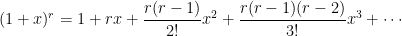

这里之所以叫二项式理论,是因为牛顿当时是拼接直觉和一定的数学知识推导出来的公式,并没有给出严格的证明.
### [牛顿的二项式定理一](https://ccjou.wordpress.com/2013/11/01/%E7%89%9B%E9%A0%93%E7%9A%84%E4%BA%8C%E9%A0%85%E5%BC%8F%E5%AE%9A%E7%90%86-%E4%B8%8A/)
上文中提到  "像多数的数学家一样，牛顿相信数学的基本形式无所不在", 就是这么个想法推动牛顿大胆猜想,得到如下的公式:

而且牛顿毕竟还是非常厉害的数学家,他将上述公式推广到更一般的形式:

### [牛顿的二项式定理二](https://ccjou.wordpress.com/2013/11/05/%E7%89%9B%E9%A0%93%E7%9A%84%E4%BA%8C%E9%A0%85%E5%BC%8F%E5%AE%9A%E7%90%86-%E4%B8%8B/)
