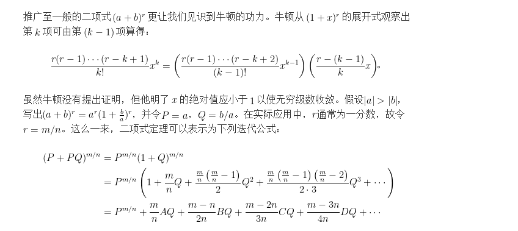

这里之所以叫二项式理论,是因为牛顿当时是拼接直觉和一定的数学知识推导出来的公式,并没有给出严格的证明.
### [牛顿的二项式定理一](https://ccjou.wordpress.com/2013/11/01/%E7%89%9B%E9%A0%93%E7%9A%84%E4%BA%8C%E9%A0%85%E5%BC%8F%E5%AE%9A%E7%90%86-%E4%B8%8A/)
### 上文中提到  ```"像多数的数学家一样，牛顿相信数学的基本形式无所不在"```, 就是这么个想法推动牛顿大胆猜想,得到如下的公式:


### 而且牛顿毕竟还是非常厉害的数学家,他将上述公式推广到更一般的形式:




### [牛顿的二项式定理二](https://ccjou.wordpress.com/2013/11/05/%E7%89%9B%E9%A0%93%E7%9A%84%E4%BA%8C%E9%A0%85%E5%BC%8F%E5%AE%9A%E7%90%86-%E4%B8%8B/)
### 这里将会发现,原来广义二项式定理是为了求圆周率而无意中发现的,历史上很多重要的发现都是不经意的发现,求知的精神难能可贵!


总得来看广义二项式定理的核心灵感: 一切数学规则应该具有普遍的数据规律,或者说某种有规则的数列(级数);在这个思想的启发下,就促成了一项伟大的发明.
